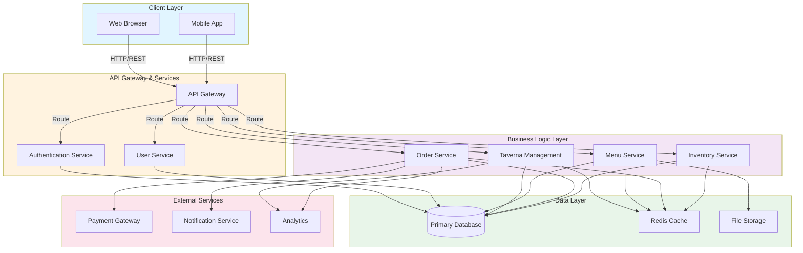

# Architecture Overview

This document provides a visual overview of the system architecture for the Blue Olives Taverna project.

## System Architecture Diagram

## Architecture Components

### Client Layer
- **Web Browser**: Responsive web interface for customers and staff
- **Mobile App**: Native mobile application for on-the-go access

### API Gateway & Services
- **API Gateway**: Central entry point for all client requests, handles routing and load balancing
- **Authentication Service**: Manages user authentication and authorization
- **User Service**: Handles user profiles and account management

### Business Logic Layer
- **Taverna Management**: Core taverna operations and settings
- **Menu Service**: Manages menu items, categories, and pricing
- **Order Service**: Processes and manages customer orders
- **Inventory Service**: Tracks stock levels and inventory management

### Data Layer
- **Primary Database**: Main persistent data store for all application data
- **Redis Cache**: In-memory caching for frequently accessed data
- **File Storage**: Stores images, documents, and other file assets

### External Services
- **Payment Gateway**: Processes payment transactions
- **Notification Service**: Sends emails, SMS, and push notifications
- **Analytics**: Collects and analyzes business metrics

## Data Flow

1. **User Requests** flow through the Client Layer via HTTP/REST to the API Gateway
2. **API Gateway** routes requests to appropriate service based on the endpoint
3. **Services** execute business logic and interact with the Data Layer
4. **External Services** are called when needed (payments, notifications, analytics)
5. **Responses** are returned back through the gateway to the client

## Key Design Patterns

- **Microservices Architecture**: Independent services for scalability
- **API Gateway Pattern**: Centralized entry point for all requests
- **Caching Strategy**: Redis cache reduces database load
- **Service-Oriented Design**: Separation of concerns across services
